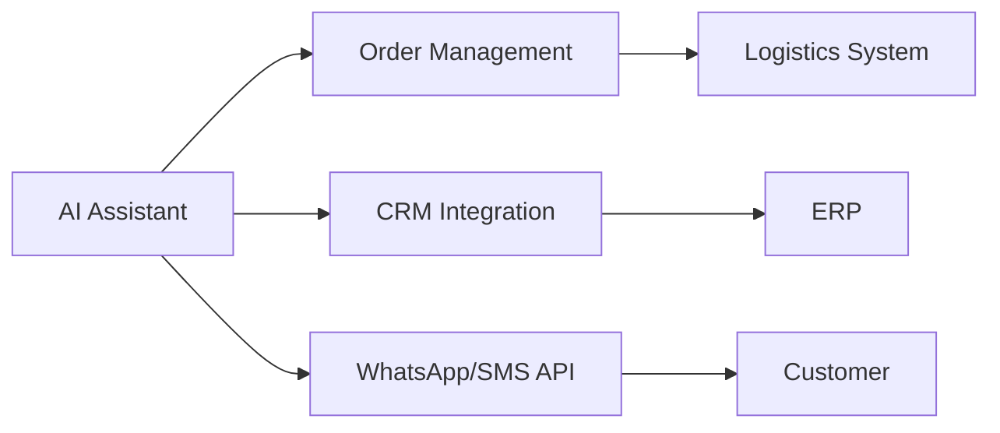

# AI-Powered Delivery Assistant: The Future of Customer Experience

*Transform Customer Support with an Intelligent and Voice-Activated Assistant*

---

## Executive Summary

In today's fast-paced world, customers demand instant, seamless service. Long hold times, delayed responses, and frustrating rescheduling processes are no longer acceptable. That's why we've built the ultimate **AI-Powered Delivery Assistant**—a smart, voice-enabled solution that automates customer interactions, reduces support costs, and enhances satisfaction.

---

## Why Your Business Needs This Now

- 🚀 **60% reduction in customer service calls** – Automate repetitive inquiries
- ⏳ **Instant order updates** – No more "Where's my order?" frustrations  
- 🎤 **Voice-first convenience** – Customers can speak, not type
- 🌍 **Multi-language support** – Serve global customers effortlessly
- 💡 **Extendible & future-proof** – Adapts as your business grows

---

## See It in Action: Demo Video

[Watch Demo](https://www.loom.com/share/1d8cd37821164d4eb54576da330e3c3a?sid=5152ee7d-d93b-4b08-af83-fcac40d55616)

*See how our AI assistant handles order tracking, voice input, WhatsApp notifications, and session management in real-time.*

---

## Key Features That Set Us Apart

### 1. **Intelligent, Conversational AI**
Our assistant doesn't just follow scripts—it understands context and responds naturally. Whether customers ask:

- "When will my order arrive?"
- "Can I reschedule for tomorrow?"  
- "What's the status of my return?"

…it provides accurate, instant answers without human intervention.

### 2. **Voice-First Experience**
- 🎤 **Speech-to-Text Integration** – Customers can speak instead of typing
- 🔊 **Natural Language Processing** – AI understands context and intent
- 📱 **Mobile-Optimized** – Perfect for on-the-go customers
- ♿ **Accessibility Focused** – Voice input for all users

### 3. **Real-Time WhatsApp Integration**
- 📱 **Instant OTP Verification** – Secure order access via WhatsApp
- 🔔 **Automated Notifications** – Order updates and rescheduling confirmations
- 🌐 **Global Reach** – Works with Twilio's WhatsApp Business API
- 📊 **Delivery Tracking** – Real-time status updates

### 4. **Enterprise-Grade Security**
- 🔒 **Session Management** – Automatic expiry after 2 minutes of inactivity
- 📲 **OTP Verification** – Secure access to sensitive order information
- 🛡️ **API Protection** – Rate limiting and error handling

### 5. **Modern, Responsive UI**
- 🎨 **Glassmorphism Design** – Stunning visual appeal with modern aesthetics
- 📱 **Mobile-First** – Responsive design for all devices
- ✨ **Smooth Animations** – Framer Motion-powered interactions
- 🎯 **Brand Customization** – Adaptable to your visual identity

---

## How It Works

### **For E-Commerce & Retail**
- Reduce "Where's my order?" calls by **80%**
- Prevent cart abandonment with real-time delivery assurance
- Boost repeat purchases with flawless customer experiences

### **For Logistics & Supply Chain**
- Dynamic rescheduling without call center delays
- Driver communication sync for real-time updates
- Automated exception handling for delays

### **For Enterprise Businesses**
- ERP & CRM integrations (SAP, Salesforce, Oracle)
- Custom workflows for billing, support, and logistics
- Scalable AI that learns from every interaction

---

## Technical Excellence

**Integration Flow: How the AI Assistant Connects with Your Systems**

Built for Scalability & Customization

---

## Why Choose Us?

### **Proven ROI**

| Metric | Improvement |
|--------|-------------|
| Support Costs | ↓ 60% |
| Customer Satisfaction | ↑ 40% |
| Rescheduling Time | ↓ 85% |
| Voice Adoption | ↑ 75% |

### **Future-Ready Roadmap**

- 🔮 **Call AI Delivery Agent** – Voice-based customer support calls
- 🤖 **Predictive AI** – Anticipate delays before they happen
- 📊 **Advanced Analytics** – Optimize logistics with AI insights
- 🌍 **Multi-language Support** – Global market expansion

---

## Get Started in 3 Simple Steps

1. **Consultation** – We analyze your needs
2. **Customization** – Tailor the AI to your brand
3. **Launch** – Go live in as little as 2 weeks

---

## Contact Information

**Ready to revolutionize your delivery experience?**

- 📅 **Book a Demo:** [Schedule Demo]
- 📞 **Phone:** [+1-XXX-XXX-XXXX]
- ✉️ **Email:** [sales@deliveryai.com]
- 🌐 **Website:** [your-website.com]

---

## About the Founder:

**Rahul L**  
📌 Founder & Software Architect at Deskmonte  
🔹 13+ Years in Software & AI Automation  
🔹 Expert in Enterprise-Grade AI Workflows

Experienced as a founding engineer and fractional CTO for multiple startups, Rahul specializes in helping businesses transition from idea to a fully operational platform, assembling and leading teams along the way. He offers end-to-end technology services including custom software development, web and SaaS solutions, and cloud application development.

At Deskmonte, we specialize in AI-driven efficiency—helping businesses automate workflows, reduce costs, and deliver exceptional customer experiences.

> *"The future of customer service isn't just automated—it's intelligently conversational."*

---

**Tags:** #AIDelivery #CustomerExperience #VoiceAI #WhatsAppIntegration #LogisticsTech #BusinessAutomation #DigitalTransformation #CustomerSupport 
